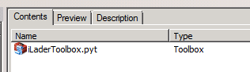
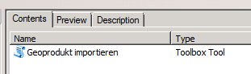
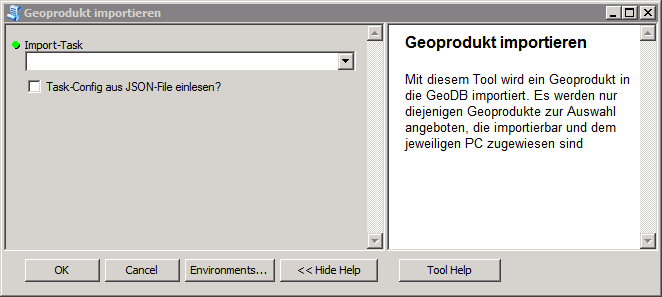
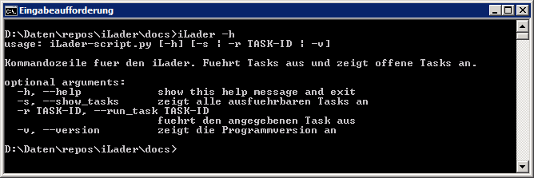
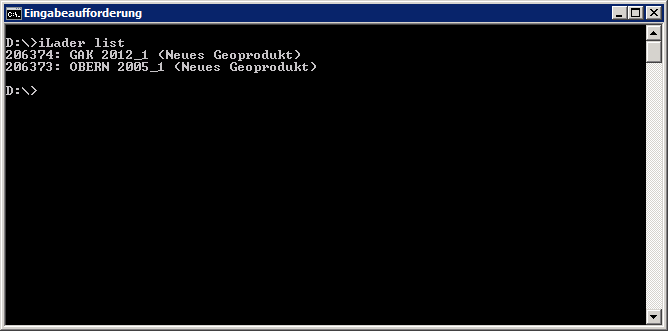
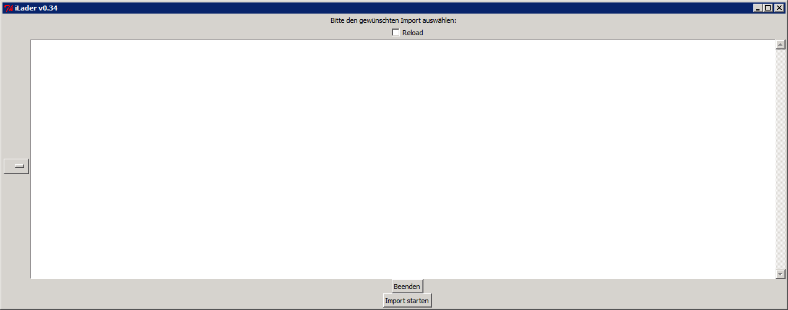

Benutzeranleitung
=================
Der iLader kann auf vier verschiedene Arten genutzt werden:

* ArcGIS-Toolbox
* Kommandozeile
* GUI
* Python

ArcGIS-Toolbox
--------------
Teil des iLader ist eine ArcGIS Python-Toolbox. Sie ist abgelegt unter ``../Python27/ArcGIS10.2/Lib/site-packages/iLader/helpers``. Wenn in ArcCatalog in dieses Verzeichnis navigiert wird, sollte die Toolbox automatisch angezeigt werden:

In der Toolbox befindet sich ein einzelnes Tool namens ``Geoprodukt importieren``, das ausgeführt werden kann:

Der Tool-Dialog präsentiert sich wiefolgt:

Es werden nur diejenigen Importe angezeigt, die zum aktuellen Zeitpunkt ausgeführt werden können. Es können keine anderen Importe ausgewählt werden.

Kommandozeile
-------------
Mit dem iLader wird auch ein Kommandozeilen-Interface installiert. Es heisst iLader.exe und liegt im Verzeichnis ``../Python27/ArcGIS10.2/Scripts``. Mit ``iLader -h`` werden die erlaubten Parameter angezeigt:

Mit ``iLader list`` werden die zur Zeit importierbaren Geoprodukte ausgegeben. Angezeigt wird die Task-ID, der Geoprodukt-Code, der Zeitstand sowie der Usecase:

Mit ``iLader run TASKID`` kann der Import gestartet werden. Mit dem Setzen des Flags ``-l`` kann eine bestehende Task-Config geladen werden. Die Task-Config wird dann nicht mehr aus dem DD ausgelesen.

Die beiden Befehle ``encrypt`` und ``decrypt`` sind noch nicht implementiert.

GUI
----------
Mit dem iLader wird auch eine einfache GUI-Oberfläche installiert. Sie heisst iLaderGUI.exe und liegt im Verzeichnis ``../Python27/ArcGIS10.2/Scripts``.
Im Moment ist die GUI funktionsfähig, sie friert aber in der Regel während des Importvorgangs ein. Der Importvorgang läuft aber weiter. Die GUI wird nach Ende des Imports wieder ansprechbar:

Python
-------------
Ein Import kann auch in einem anderen Python-Script ausgelöst werden, z.B. mit folgendem Code:

``from iLader.usecases.Usecase import Usecase``

``uc = Usecase(task_id, load_task_config)``

``uc.run()``
